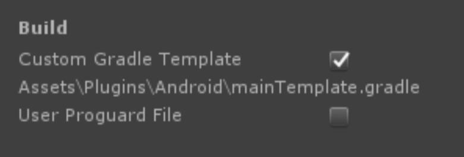

# 오큐파이 포털파인더 Unity Plugin

- 이 저장소에는 오큐파이 포털파인더를 사용하기 위한 Unity Plugin 원본 소스와 빌드된 unitypackage 파일, 예제 소스코드(`Assets/Library/Oqupie/Example/Example.cs`)가 포함돼있습니다. 
- OqupieSupportSDK 유니티는 2019.3.7에서 테스트되었습니다. 구체적인 사항은 첨부된 예제 프로젝트를 참고하세요.

## 플러그인 연동

### 1. 패키지 임포트(Android & iOS 공통)

- 저장소를 clone하거나 다운 받으으세요.
- 유니티 에디터를 실행하여 새로운 프로젝트를 생성한 후 Assets > Import Package > Custom Package... 를 선택합니다.
- 다음 파일(`dist/OqupieSupportSDK.unitypackage`)을 유니티로 임포트합니다.

### 2. Android 플러그인 연동

#### 2-1. 퍼미션 설정

일반적으로 유니티 빌드 과정 중에 aar 파일 내부의 AndroidManifest.xml이 자동으로 병합되기 때문에 별도의 설정이 필요 없습니다. 다만, 유니티의 특정 버전에서에서 빌드시 android:maxSdkVersion="18" 속성이 추가되면서 API 18 이상의 OS 환경에서 앱을 실행할 때 퍼미션이 제대로 적용되지 않는 경우가 있습니다. 이 경우 Plugins/Android 폴더에서 AndroidManifest.xml를 만들고 다음과 같이 명시적으로 퍼미션을 설정해 줍니다.

```xml
<uses-permission android:name="android.permission.INTERNET" />
<uses-permission android:name="android.permission.READ_EXTERNAL_STORAGE" />
```

옵션: 만약 앱 설치시 뜨는 퍼미션 대화상자를 비활성화하려면 아래 meta-data를 추가합니다.
```xml
<meta-data android:name="unityplayer.SkipPermissionsDialog" android:value="true" />
```

#### 2-2. Gradle 설정

- Mininum API Level은 21 이상으로, Target API Level은 28 이상으로 설정하세요.
- Custom Gradel Template을 생성하고 아래처럼 'androidx.legacy:legacy-support-v4:1.0.0' 라이브러리를 추가해 주세요.



```gradle
dependencies {
    implementation fileTree(dir: 'libs', include: ['*.jar'])
    implementation 'androidx.legacy:legacy-support-v4:1.0.0'  // 충돌 시 제거
**DEPS**}
```
참고: `support-v4` 라이브러리 충돌이 일어날 경우 해당 부분(`implementation 'androidx.legacy:legacy-support-v4:1.0.0'`)을 빼주고 빌드합니다.

### 3. iOS 플러그인 연동

#### 3-1. Xcode 프로젝트 빌드 후 실행

OqupieSupportSDK는 iOS 9.0 이상에서 이용가능하므로 iOS 프로젝트 빌드시 Target mininum OS version을 9.0 이상으로 설정합니다.


### 4. 포털파인더 연결

SDK를 연결하려는 모바일 앱의 1:1 문의, 고객센터 등의 고객지원 관련 버튼 클릭 시 아래의 코드가 실행될 수 있도록 내용을 추가합니다. 예제 코드는 `Assets/Library/Oqupie/Example/Example.cs`에 있습니다.

예제 코드
```csharp
var appInfo = OqupieManager.Instance.GetAppInfo();

appInfo.AddInfo("userName", "Michael");
appInfo.AddInfo("userId", "unitymania");
appInfo.AddInfo("applicationLanguage", "English");
appInfo.AddInfo("userEmail", "example@onionfive.io");
appInfo.AddInfo("access_key", "2190ffccd8dbb478");
appInfo.AddInfo("secret_key", "dde1cc31a14524bf903b2b1e71a8afde");
appInfo.AddInfo("brand_key1", "ko");
appInfo.AddInfo("brand_key2", "goodgame");
appInfo.AddInfo("brand_key3", "asia");
appInfo.AddInfo("게임엔진", "유니티");
appInfo.AddInfo("vip_code", "VVIP");

OqupieManager.Instance.OpenWebView("https://{subdomain}.oqupie.com/portals/finder", appInfo, true, "고객센터", new Color32(127, 115, 231, 255));
```
1. OqupieManager 싱글턴 객체를 이용하여 앱 정보 데이터를 읽어 옵니다.
    ```csharp
    var appInfo = OqupieManager.Instance.GetAppInfo();
    ```

1. 추가적인 사용자 또는 앱 정보를 자유롭게 입력할 수 있습니다.
    ```csharp
    appInfo.AddInfo("userName", "Michael");
    appInfo.AddInfo("userId", "unitymania");
    appInfo.AddInfo("applicationLanguage", "English");
    appInfo.AddInfo("userEmail", "example@onionfive.io");
    appInfo.AddInfo("access_key", "2190ffccd8dbb478");
    appInfo.AddInfo("secret_key", "dde1cc31a14524bf903b2b1e71a8afde");
    appInfo.AddInfo("brand_key1", "ko");
    appInfo.AddInfo("brand_key2", "goodgame");
    appInfo.AddInfo("brand_key3", "asia");
    appInfo.AddInfo("게임엔진", "유니티");
    appInfo.AddInfo("vip_code", "VVIP");
    ```

1. 고객센터 웹뷰를 열면서 `appInfo`에 입력한 정보를 전송합니다. 이 때 타이틀, 타이틀바 배경색 등을 선택할 수 있습니다.
    ```csharp
    OqupieManager.Instance.OpenWebView("https://{subdomain}.oqupie.com/portals/finder", appInfo, true, "고객센터", new Color32(127, 115, 231, 255));
    ```
1. 액세스키와 시크릿키 및 브랜드키 설정은 [포털파인더 가이드](https://www.notion.so/onionfivecorp/2d67a57c22074cfd9e1d2d68f1a3e84d)에서 다시 확인할 수 있습니다.
    ```csharp
    appInfo.AddInfo("access_key", "2190ffccd8dbb478");  // access_key는 필수 입니다.
    appInfo.AddInfo("secret_key", "dde1cc31a14524bf903b2b1e71a8afde");  // secret_key는 필수 입니다.

    // brand_key1, 2, 3은 포털파인더 설정에 따라 입력해주세요. brand_key1은 필수이지만 나머지는 필수가 아닐 수도 있습니다.
    appInfo.AddInfo("brand_key1", "ko");
    appInfo.AddInfo("brand_key2", "goodgame");
    appInfo.AddInfo("brand_key3", "asia");
    ```
1. 포털파인더 엔드포인트는 `https://{subdomain}.oqupie.com/portals/finder` 입니다. `{subdomain}`부분은 해당 계정의 서브도메인으로 변경하시면 됩니다. 
    ```csharp
    OqupieManager.Instance.OpenWebView("https://{subdomain}.oqupie.com/portals/finder", appInfo, true, "고객센터", new Color32(127, 115, 231, 255));
    ```
